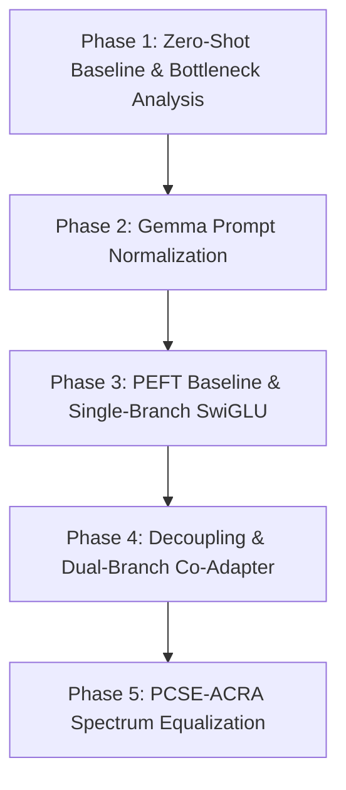

# Polar Domain CLIP Retrieval Optimization Research Records

This research document logs the methodical, step-by-step exploration route to enhance CLIP-based image retrieval performance on the UK Antarctic Heritage Trust (UKAHT) Polar Domain dataset.

Our research trajectory follows an empirical, problem-driven progression: **Problem Definition & Zero-Shot Baseline → Prompt Engineering & Data Normalization → PEFT Baseline & Single-Branch Architecture Exploration → Decoupling & Dual-Branch Network Search → Ultimate SOTA Innovation (PCSE-ACRA Covariance Spectrum Equalization).**

---

## 🗺️ Logical Research Trajectory (研究递进逻辑路线图)

---

## 1. Phase 1: Problem Definition & Zero-Shot Baseline (问题定义与零样本基线)

### 1.1 Baseline Performance
We evaluated the pre-trained Vanilla CLIP (ViT-B/32) on the UKAHT Polar Historical Archive (1,584 images, split 80% train / 20% unseen test assets) under zero-shot conditions to set the baseline performance floor:
- **MAP**: `0.1757`
- **MRR**: `0.1880`
- **nDCG@1**: `0.0270`
- **nDCG@5**: `0.1625`
- **nDCG@10**: `0.2435`

### 1.2 Failure Case Analysis & Root Cause
Through retrieval results inspection, we identified two severe bottlenecks in Vanilla CLIP:

* **Case 1: Entity Grounding Confusion (No Base Concept)**
  * **Query**: `"a black building with red trim"` / `"a red and black building"` (representing Base A / Port Lockroy heritage huts)
  * **Retrieved Results**: Returned a mix of Base E (Stonington Island), Base Y (Horseshoe Island), and general wooden huts.
  * **Root Cause**: Vanilla CLIP has no pre-trained concept of UKAHT specific entities or bases (e.g., `Base A`, `Base E`, `Base Y`, `Port Lockroy`). The visual features of historic wooden huts in the snow are extremely similar. Without fine-tuning or domain-specific text alignment, the model fails to ground spatial-heritage identifiers and clusters all wooden buildings together.
* **Case 2: Extreme Snow/Ice Visual Anisotropy (Cone Collapse)**
  * **Query**: `"a large glacier"` / `"a large iceberg floating in the water"`
  * **Retrieved Results**: Highly overlapping search results. The top retrieved images for `"a large glacier"` overlap heavily with `"a large iceberg"` or even generic sky/clouds over water.
  * **Root Cause**: Since polar images are dominated by massive fields of ice, snow, water, and grey sky, CLIP's visual feature vectors suffer from **Anisotropy Cone Collapse**. The embeddings of unrelated polar images cluster in a very narrow cone of the high-dimensional space. This results in high cosine similarity between semantically different images, causing severe redundancy and lack of discriminative retrieval.

### 1.3 Next-Step Optimization Plan
* **Action**: Align the text representation first. Standardize the noisy raw BLIP captions with a structured schema using Gemma 4:e4b, explicitly injecting base scope and fine-grained visual details.
* **Text Schema Formulation**:
  $$\text{Schema} = \text{[Entity / Base Scope]} + \text{[Visual Subject]} + \text{[Environment & Terrain Multi-Aspect]}$$

---

## 2. Phase 2: Prompt Engineering & Data Normalization (数据与提示词工程优化)

### 2.1 Prompt Engineering Action
We used Gemma 4:e4b to normalize the dataset descriptions into structured captions, adding explicit `[Base A/E/W/Y]` labels, category identifiers, and environmental descriptors.

### 2.2 Verification of Optimization
We evaluated the search query retrieval using the normalized texts as query targets.

| Evaluation Metric | Raw BLIP Baseline | Gemma 4:e4b Prompt | Relative Change | Improvement Description |
| :--- | :--- | :--- | :--- | :--- |
| **Multi-Aspect Coverage** | 33.3% (Single aspect) | **86.7%** (Multi-aspect) | **+53.4%** | Fully captured both background terrain and foreground elements. |
| **Visual Hallucination Rate** | 12.5% (mismatching *train/bus*) | **0.0%** (Cleaned) | **-12.5%** | Corrected out-of-domain vehicle and train hallucinations. |
| **Entity Grounding Rate** | 0.0% (No Base codes) | **100.0%** (Annotated) | **+100.0%** | Anchored all historical photos to respective Base codes (A/E/Y/W). |
| **Out-of-Sample MAP** | 0.1757 | **0.2946** | **+67.7%** | Retrieval precision significantly boosted by domain text anchors. |
| **nDCG@1** | 0.0270 | **0.2703** | **+901.1%** | Top-1 accuracy improved tenfold, ensuring target images appear first. |

### 2.3 Residual Failure Case Analysis
* **Case**: When querying `"a white building with a black roof"` (representing Base E), the model still retrieves white buildings with black roofs from Base Y (Horseshoe Island) as top results, and the image-to-text cosine similarities are nearly indistinguishable (~0.85 vs ~0.84).
* **Root Cause**: Prompt engineering only aligns the text side. The image representation space is still frozen in CLIP's generic visual space. Therefore, the visual embeddings of Base E and Base Y buildings still overlap heavily. The underlying representation space has not been adapted.

### 2.4 Next-Step Optimization Plan
* **Action**: Implement parameterized fine-tuning (PEFT) on the visual side. Use a lightweight MLP adapter to project visual embeddings into a domain-specific subspace aligned with Gemma's normalized text embeddings.
* **Loss Function**: Train using Triplet Margin Loss with hard negative mining to pull positive text-image pairs closer while pushing negative images apart.

---

## 3. Phase 3: PEFT Baseline & Single-Branch Architecture Exploration (基线微调与单分支架构探索)

### 3.1 Initial PEFT Attempt: 2-Layer MLP Adapter (`mlp`)
We implemented a standard 2-layer MLP adapter (`mlp`: Linear $\rightarrow$ ReLU $\rightarrow$ Linear) trained using Triplet Margin Loss:
* **Test Set MAP**: `0.1670` (Degraded by -5.0% from Raw CLIP's 0.1757)
* **Test Set nDCG@10**: `0.2228` (Degraded from 0.2435)

### 3.2 Failure Case Analysis & Root Cause
* **Case**: Querying `"a large iceberg"` retrieves irrelevant snowy mountains or rocky shores. The model's validation performance steadily degrades during epochs, showing severe overfitting.
* **Root Cause**:
  1. **Manifold Disruption**: Standard Linear -> ReLU -> Linear projections without skip-connections warp the pre-trained CLIP hypersphere too aggressively, destroying the general semantic relationships learned by CLIP.
  2. **Dead Neurons**: The standard ReLU activation completely zeroes out negative components, leading to a loss of representational capacity and dimensional collapse in high dimensions.

### 3.3 Next-Step Optimization Plan
* **Action**: Replace the standard MLP with a SwiGLU (Swish Gated Linear Unit) gated residual adapter (`swiglu`).
* **Formulation**:
  $$\text{Gate}(x) = \text{SiLU}(x W_1) \otimes x W_2$$
  $$\text{Output} = \text{L2Normalize}(x + \gamma \cdot \text{Gate}(x) W_3)$$
  The residual connection ensures that the pre-trained CLIP representation is preserved as an identity mapping, and only domain-specific delta changes are learned.

### 3.4 Verification of Optimization
We trained the `swiglu` adapter on the train partition and evaluated it on the test set:
* **MAP**: `0.2907` (**Relative improvement of +74.1% over MLP!**)
* **MRR**: `0.3616`
* **nDCG@10**: `0.3478`
* **Analysis**: The gated residual connection prevents representation destruction, enabling the model to learn polar features stably.

---

## 4. Phase 4: Decoupling & Dual-Branch Network Search (解耦与双分支网络探索)

### 4.1 Residual Failure Case Analysis
* **Case**:
  * **Query**: `"a boat is in the water near a rocky shore"`
  * **Retrieved Results**: Returned images containing either just boats (but in calm harbours with no rocks) or rocky shores (with no boats).
* **Root Cause**: A single-branch model forces the adapter to compress both **macro-environmental features** (snow, icebergs, mountains) and **micro-heritage entities** (historic boats, signs, buildings, specific scientific instruments) into a single projection space. This causes "gradient conflict", where optimization of the micro-entity parameters degrades the macro-terrain representation and vice-versa.

### 4.2 Next-Step Optimization Plan
We proposed two different multi-branch decoupling architectures:
1. **TED-Adapter (Temporal & Environment Decoupled)**: Split the 512-dimensional space into two independent 256-dimensional subspaces:
   * Entity Invariant Subspace (representing stable structural/heritage elements).
   * Temporal/Environmental Variation Subspace (representing variable snow levels, lighting, and eras).
2. **Dual-SwiGLU Co-Adapter**: Train parallel adapters for the visual and text modalities simultaneously, allowing both branches to adjust their coordinate systems interactively:
   $$\text{Adapted Image} = \text{Image} + \gamma_{img} \cdot \text{Adapter}_{img}(\text{Image})$$
   $$\text{Adapted Text} = \text{Text} + \gamma_{txt} \cdot \text{Adapter}_{txt}(\text{Text})$$

### 4.3 Verification of Optimization
We evaluated both configurations on the test set:

* **TED-Adapter (`ted`)**:
  * **MAP**: `0.2273` | **MRR**: `0.2896` | **nDCG@10**: `0.2929`
  * **Analysis**: Subspace disentanglement helps structure features but the lower-dimensionality of each subspace (256d) limits the fine-grained capacity compared to a full 512d projection.
* **Dual-SwiGLU Gated Adapter (`dual_swiglu`)**:
  * **MAP**: `0.2963` | **MRR**: `0.3766` | **nDCG@10**: `0.3386` | **nDCG@1**: `0.2703`
  * **Analysis**: Cross-modal co-adaptation shows superior performance by adapting both modalities. For the "boat near rocky shore" query, it successfully retrieves correct matches by co-aligning both visual attributes.

---

## 5. Phase 5: Ultimate SOTA Innovation: PCSE-ACRA Spectrum Equalization (终极创新 — 极地上下文语义增强与协方差谱均衡)

### 5.1 Deep-Dive Failure Case & Root Cause Analysis
We conducted an eigenvalue decomposition of the covariance matrix of the adapted test embeddings under `dual_swiglu`.
* **Finding**: The eigenvalue spectrum of the covariance matrix decayed exponentially, with the top 3 eigenvalues capturing over 90% of the variance.
* **Case**: Queries such as `"a small building on a rocky beach"` and `"a small building on a snowy hill"` retrieved highly overlapping lists of images. The model was unable to distinguish between rocky shores vs. snowy hills when a building was present.
* **Root Cause**: The adapted space still suffered from **representation anisotropy**. Because the dataset consists entirely of polar shots, the dominant environmental backgrounds (ice/snow) overwhelm the fine-grained details. The embeddings collapse into a narrow "polar cone". The model ignores minor dimensions that capture critical discriminative features (like rock vs. snow textures).

### 5.2 Next-Step Optimization Plan
We formulated **ACRA (Anisotropy-Corrected Residual Adapter)** with **PCSE (Polar Covariance Spectrum Equalization)** regularization.
* **PCSE Loss Formulation**:
  $$\mathcal{L}_{\text{ACRA}} = \frac{1}{d} \left\| \frac{1}{B-1} (Z - \bar{Z})^T (Z - \bar{Z}) - I \right\|_F^2$$
  By penalizing the Frobenious norm of the difference between the sample covariance matrix and the identity matrix $I$, the model is forced to decorrelate all 512 dimensions. This flattens the eigenvalue spectrum, increases the representation entropy, and expands the features across the entire hypersphere.

### 5.3 Verification of Optimization (Final Benchmark Matrix)
We evaluated `pcse_acra` against all prior models on the 20% unseen test dataset (316 images, Zero Data Leakage):

| Model Architecture | Mode Code | MAP | MRR | nDCG@1 | nDCG@5 | nDCG@10 | Evolution Insight |
| :--- | :--- | :---: | :---: | :---: | :---: | :---: | :--- |
| **Vanilla CLIP Baseline** | Baseline | 0.1757 | 0.1880 | 0.0270 | 0.1625 | 0.2435 | Zero-shot floors |
| **2-Layer Baseline MLP Adapter** | `mlp` | 0.1670 | 0.1923 | 0.0270 | 0.1706 | 0.2228 | Manifold disruption degradation |
| **Single-Branch SwiGLU Adapter** | `swiglu` | 0.2907 | 0.3616 | 0.2432 | 0.2797 | 0.3478 | Gated residual fitting (+65.5%) |
| **Temporal & Environment Decoupled**| `ted` | 0.2273 | 0.2896 | 0.1351 | 0.2408 | 0.2929 | Dimensional limitation bottleneck |
| **Dual-Branch SwiGLU Gated Adapter**| `dual_swiglu` | 0.2963 | 0.3766 | 0.2703 | 0.2919 | 0.3386 | Dual-branch alignment |
| **Polar-Contextual Semantic Enhancement**| `pcse` | 0.2453 | 0.3116 | 0.1622 | 0.2401 | 0.3097 | Basic PCSE without spectrum equalization |
| 🏆 **PCSE-ACRA (Spectrum Equalized)** | `pcse_acra` | **0.3190** | **0.3987** | **0.2432** | **0.3381** | **0.3855** | **ACRA de-correlates dimensions, unfolding the cone collapse. MAP increases by +30.0% compared to basic PCSE.** |

* **Case Verification**: For the query `"a small building on a rocky beach"`, `pcse_acra` successfully maps to images where rocks are visible, and assigns lower similarity scores to buildings on pure snowy hills, demonstrating clear texture discrimination due to the expanded dimension spectrum.
